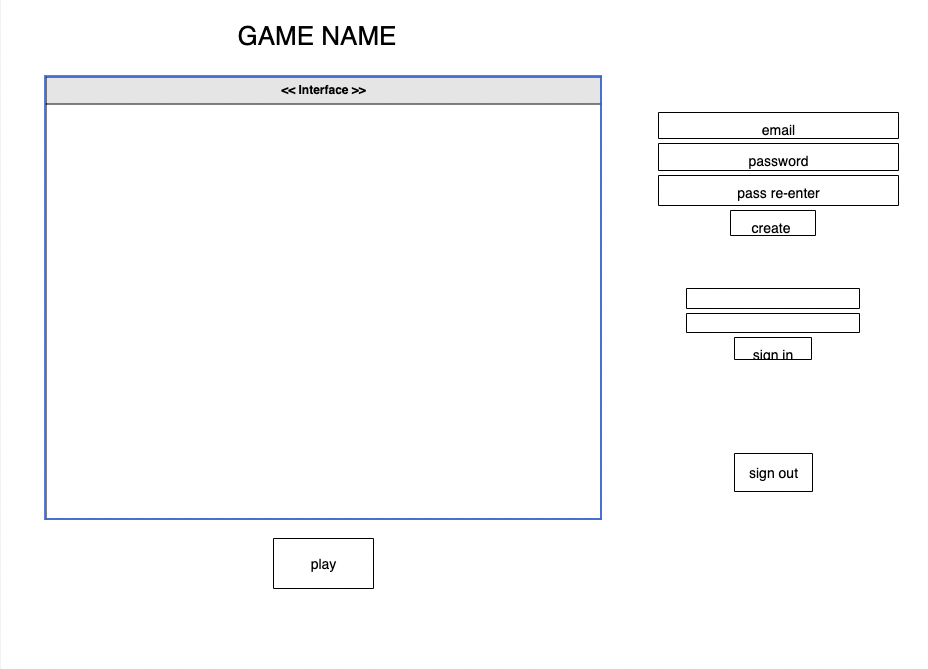

**This is a Tic Tac Toe game in with the user can play locally with one other person.**

**User story**

-The user is able to sign up using the sign up form

-The user is able to sign in after creating an account 

-The user is able to start in which locally is able to play against someone 

-The user is able to restart the game after the match is complete 

-The User is able to sign out after they are done playing

**Wireframe** 

**Git Hub Pages link:**
https://jackson916.github.io/Tic-Tac-Toe-ColinJackson/

Acknowledgements:

Web Dev simplified (youtube)

JavaScript. Plain english (website)

various git hub issue trackers